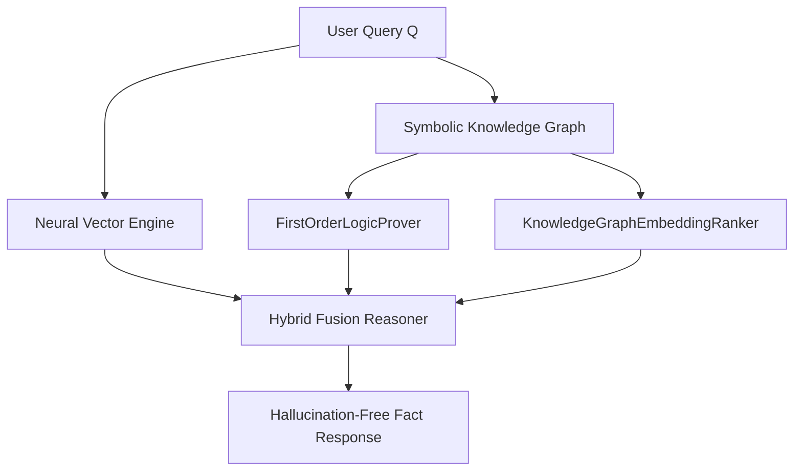

# Neuro-Symbolic GraphRAG Engine 🧠 🕸️

<div align="center">

[](https://opensource.org/licenses/MIT)
[](https://www.typescriptlang.org/)
[](https://en.wikipedia.org/wiki/Neuro-symbolic_AI)
[](https://github.com/anderdebona/neuro-symbolic-graph-rag)
[](https://github.com/anderdebona/neuro-symbolic-graph-rag/actions)

<br />

**PhD-Grade Neuro-Symbolic AI Platform Combining First-Order Logic Provers, TransE Embeddings & Vector RAG**

*Engineered by **[anderdebona](https://github.com/anderdebona)***

</div>

---

## 📌 Abstract & Research Goals

This repository presents a **PhD-grade Neuro-Symbolic AI Platform**. By unifying **Symbolic Knowledge Graphs** (RDF triples $S \xrightarrow{P} O$ and First-Order Logic Horn clauses) with **Neural Vector Search (RAG)**, it achieves deterministic, hallucination-free AI reasoning with mathematical confidence scoring.

---

## 🔬 Mathematical Formulation

### Hybrid Knowledge Fusion & TransE Embedding Energy
Given Neural Retrieval Document Set $D_{vec}$ and Symbolic Graph Constraint Set $G_{sym}$:

$$\text{Confidence}(Q) = \alpha \cdot \text{CosineSim}(E(Q), E(D_{vec})) + (1 - \alpha) \cdot \mathbb{I}(G_{sym} \models Q)$$

$$f_{\text{TransE}}(h, r, t) = - \|\mathbf{h} + \mathbf{r} - \mathbf{t}\|_2$$

---

## 🏛️ Neuro-Symbolic Architecture



---

## ⚡ What's New in v4.0.0

- 📜 **`FirstOrderLogicProver`**: Forward-chaining Horn clause resolution refutation theorem prover.
- 🎯 **`KnowledgeGraphEmbeddingRanker`**: TransE geometric vector energy scoring for link prediction.
- 🔍 **`OntologyReasoner` & `ExplainabilityEngine`**: Description logic subsumption and human-readable reasoning audit chains.
- 🐙 **Automated Multi-Matrix CI/CD**: Full GitHub Actions test suites across Node.js versions.

---

## 🚀 Quickstart & Installation

```bash
# Clone repository
git clone https://github.com/anderdebona/neuro-symbolic-graph-rag.git
cd neuro-symbolic-graph-rag

# Install dependencies
npm install

# Run automated tests
npm test

# Run Server & Visual Dashboard
npm run dev
```

Visit the interactive Web Dashboard at: **`http://localhost:3003`**

---

## 🌟 Join the Community & Contribute

Join our quest to eliminate AI hallucinations with formal mathematical logic:
1. ⭐ **Star this repository** to support neuro-symbolic AI!
2. 🗺️ Read our roadmap in [ROADMAP.md](./ROADMAP.md).
3. 💬 Propose new reasoning primitives via [GitHub Issues](https://github.com/anderdebona/neuro-symbolic-graph-rag/issues).
4. 📜 Academic citation: see [CITATION.cff](./CITATION.cff).

---

<div align="center">

Distributed under the MIT License. Built with passion by **[anderdebona](https://github.com/anderdebona)**.

</div>
