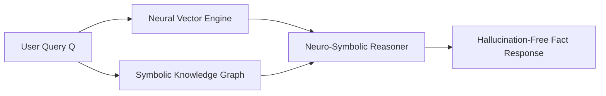

# Neuro-Symbolic GraphRAG Engine 🧠 🕸️

[](https://opensource.org/licenses/MIT)
[](https://www.typescriptlang.org/)
[](https://en.wikipedia.org/wiki/Neuro-symbolic_AI)

**Author:** anderdebona (Department of Computer Science & Artificial Intelligence)

---

## 📌 Abstract & Research Goals

This repository presents a **PhD-grade Neuro-Symbolic AI Platform**. By unifying **Symbolic Knowledge Graphs** (RDF triples $S \xrightarrow{P} O$ and First-Order Logic inference rules) with **Neural Vector Search (RAG)**, it achieves deterministic, hallucination-free AI reasoning with mathematical confidence scoring.

---

## 🔬 Mathematical Formulation

### Hybrid Knowledge Fusion Ratio ($K$)
Given Neural Retrieval Document Set $D_{vec}$ and Symbolic Graph Constraint Set $G_{sym}$:

$$\text{Confidence}(Q) = \alpha \cdot \text{CosineSim}(E(Q), E(D_{vec})) + (1 - \alpha) \cdot \mathbb{I}(G_{sym} \models Q)$$

where $\mathbb{I}(\cdot)$ is the indicator function evaluating whether First-Order Logic constraints hold without contradiction.

---

## 🏛️ Neuro-Symbolic Architecture



---

## 🚀 Quickstart & Installation

```bash
# Clone repository
git clone https://github.com/anderdebona/neuro-symbolic-graph-rag.git
cd neuro-symbolic-graph-rag

# Install dependencies
npm install

# Run Server & Visual Dashboard
npm run dev
```

Visit the interactive Web Dashboard at: **`http://localhost:3003`**

---

## 🧪 Automated Unit Testing

```bash
npm test
```

---

## 📜 Citation & License

```bibtex
@software{debona2026neurosymbolic,
  author = {anderdebona},
  title = {Neuro-Symbolic GraphRAG Engine},
  year = {2026},
  publisher = {GitHub},
  journal = {GitHub Repository},
  howpublished = {\url{https://github.com/anderdebona/neuro-symbolic-graph-rag}}
}
```

Licensed under the MIT License.
